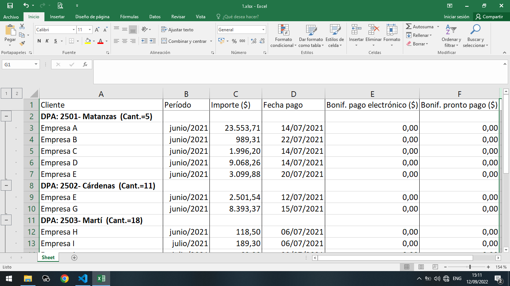
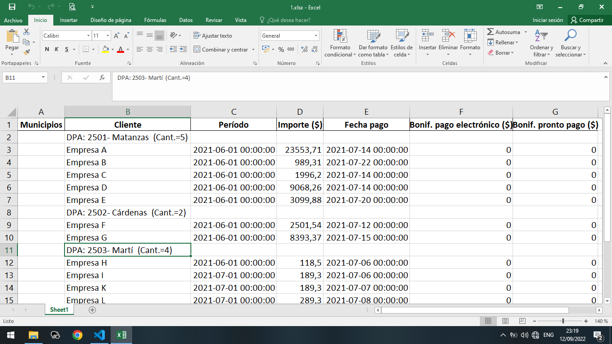
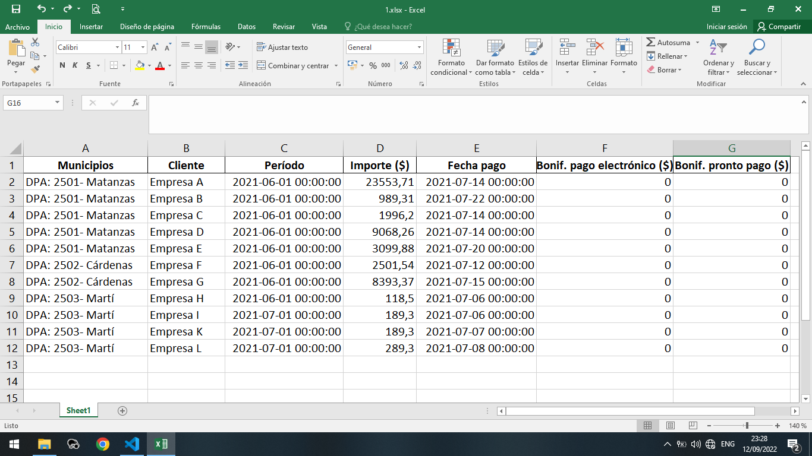
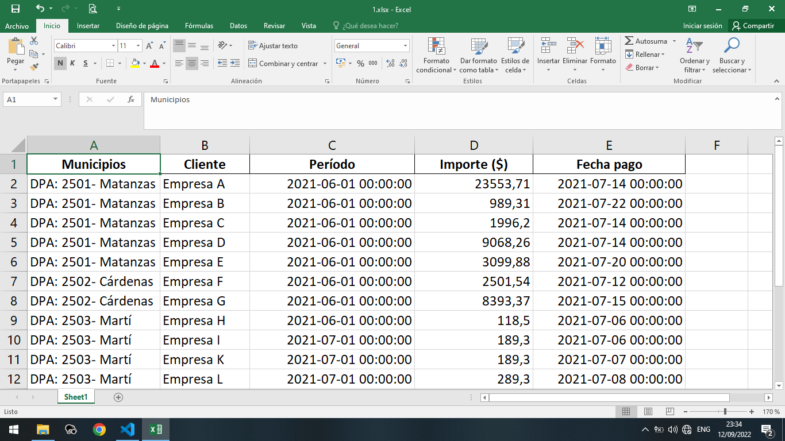
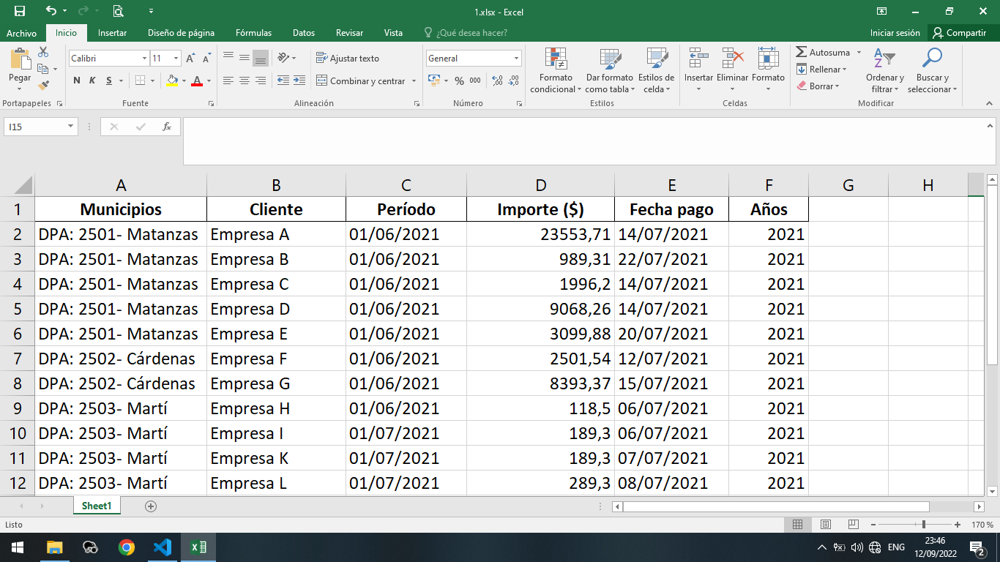
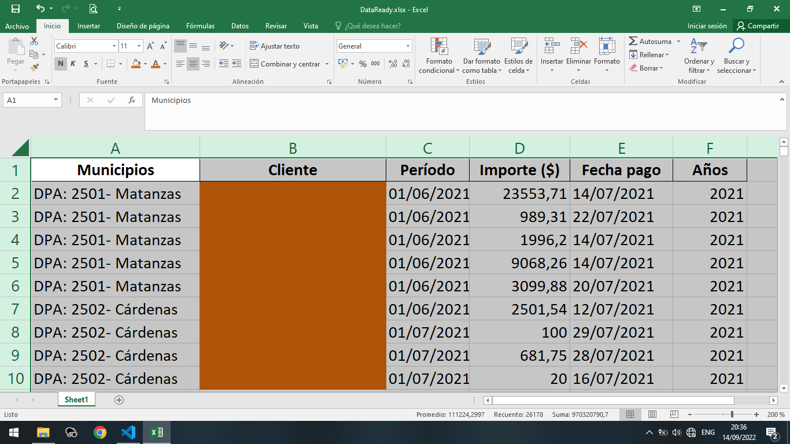
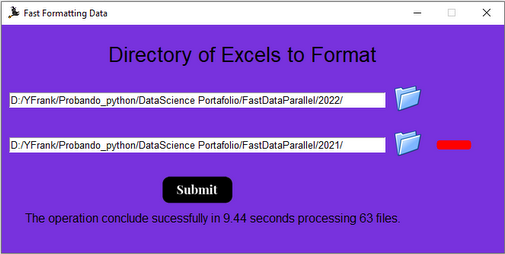
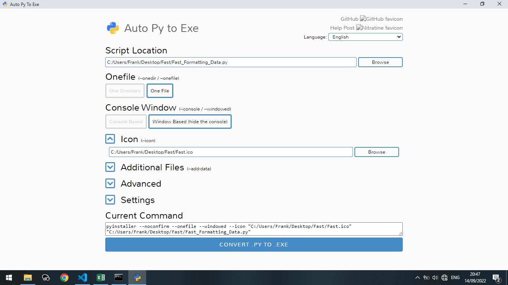

# ***Fast Formating Data***

This project was made for a local company with the goal of saving time in proccessing the output data of a software that they use. 
                                                      
Information such as the companies names was changed or hidden to protect the confidenciality of the data provided.

## Tasks:
- ### Reading the data:
- ### Create a "Municipios" column and fill with the data adquired in the next step.
- ### Analize "Cliente" column and obtain the region of each company.
- ### Delete "Bonif. pago electrónico (\$)" and "Bonif. pronto pago (\$)" columns.
- ### Create an "Años" column with the year of the "Fecha pago" columns.
- ### Set the apropiate format to "Fecha pago" and "Período" columns to allow filter the information.
- ### Create a new excel spreadsheet with the total of data processed with name "DataReady.xlsx"
- ### Create a visual interface using Tkinter.
    * Allow to users insert the path to the excel's folder of the actual year
    * Allow to users insert the path to the excel's folder of the last year
- ### Create an .exe aplication.

## Reading the data:
In the following picture are present the structure of each excel spreadsheet that is needed to proccess.

Reading an excel document is a simple step. The function read_excel() of pandas library allows to do it.
```python
import pandas as pd
df=pd.read_excel("1.xlsx", index_col=None)
```
## Create a "Municipios" column and fill with the data adquired in the next step.
The "Municipios" column was inserted at the begining of the table.
```python
df.insert(0,"Municipios","")
```



## Analize "Cliente" column and obtain the region of each company.
With a for loop through "Cliente" column we can accomplish this task.
```python
cant=[0]    #This list will save the index of each region for delete this rows
x=[0]       #This list will save the region name and the amount of companies present in each one
inicio=0    
    
for i in df["Cliente"]:
    if str(i)[:3]=="DPA":
            x=str(i).split("(Cant.=")
            df.iloc[inicio:,0]=x[0]
            inicio=inicio+int(x[1][0:-1])+1
            cant.append(inicio)
df.drop(labels=cant, inplace=True)      #Deleting all the rows present in "Cliente" column that have the region name. The last row of this column is a total of the amount of companies, by this also is deleted.
```




## Delete "Bonif. pago electrónico (\$)" and "Bonif. pronto pago (\$)" columns.
With drop we delete the columns and set inplace=True for saving the changes in the excel document

```python
df_all.drop(columns=["Bonif. pago electrónico ($)","Bonif. pronto pago ($)"], inplace=True)
```



## Create an "Años" column with the year of the "Fecha pago" columns.

```python
df["Años"]=pd.to_datetime(df["Fecha pago"]).dt.year
```


## Set the apropiate format to "Fecha pago" and "Período" columns to allow filter the information.
```python
df["Período"] = pd.to_datetime(df["Período"]).dt.strftime('%d/%m/%Y')
df["Fecha pago"] = pd.to_datetime(df["Fecha pago"]).dt.strftime('%d/%m/%Y')
```




## Create a new excel spreadsheet with the total of data processed.

Importing os we can acomplish this task implementing a for loop in the directory.

```python
import os
import pandas as pd
listas=[]
for filename in os.listdir():
    if filename!="Fast_Formatting_Data.py":
        df=pd.read_excel(filename, index_col=None) 
        cant=[0]
        df.insert(0,"Municipios","")
        x=[0]
        inicio=0
            
        for i in df["Cliente"]:
            if str(i)[:3]=="DPA":
                    x=str(i).split("(Cant.=")
                    df.iloc[inicio:,0]=x[0]
                    inicio=inicio+int(x[1][0:-1])+1
                    cant.append(inicio)
        df.drop(labels=cant, inplace=True)
        listas.append(df)

df_all=pd.concat(listas, sort=False)
df_all.drop(columns=["Bonif. pago electrónico ($)","Bonif. pronto pago ($)"], inplace=True)

df_all["Período"] = pd.to_datetime(df_all["Período"]).dt.strftime('%d/%m/%Y')
df_all["Fecha pago"] = pd.to_datetime(df_all["Fecha pago"]).dt.strftime('%d/%m/%Y')
df_all["Años"]=pd.to_datetime(df_all["Fecha pago"]).dt.year
df_all.to_excel("DataReady.xlsx",index=False)  
```


I set orange color to background font of "Cliente" column for protect the companies information.

At the bottom right corner we can see the total of the data: 26178 cells with information.


- ### Create a visual interface using Tkinter.
    * Allow to users insert the path to the excel's folder of the actual year
    * Allow to users insert the path to the excel's folder of the last year




#### For more detail the code is available on Fast_Formatting_Data.py

## Our program it's ready. Let's make a .exe aplication using auto-py-to-exe.

Seting the following options for make an one file with ico and console hiden aplication:



# Conclusion

Before this solution the employees uses to spent two days of work formatting and reuniting the data.

...Currently they can do it with just pasting the program, inside the folder that contains the excels's and clicking on it.
