# ***School Database***

This project was made for a local school to help in the manage of their students and teachers. 
                                                      
Information such as the names was changed or hidden to protect the confidenciality of the data provided.

## Tasks:
- ### Create an "Escuela.db" to save the data.
- ### Stadistics
    * Create an "Estudiantes" table. 
    * Create a "Profesor" table. 
    * Create relationship between tables to avoid insert a teacher in a group that dont have any students
- ### Create a visual interface using Tkinter.
- ### Create a login window.
- ### Create a main window if credentials are correct.
- ### Create a clock widget.
- ### Allow save information of students and teachers in csv or excels files
- ### Create the CRUD (Create,Read,Update and Delete) for both tables.
    * Analize the number of students that fail his tests of "Matemáticas","Español" or "Historia"
    * Analize the AVG (average) in "Matemáticas","Español" or "Historia"
    * Analize the number of students that score more of 95 points in his tests of "Matemáticas","Español" or "Historia"
    * Create new students or teachers
    * Read elements  
    * Update students or teachers information
    * Delete students or teachers of the table
    * Sort students or teachers information 
- ### Create an .exe aplication.

## Create an "Escuela.db" to save the data.
* Create an "Estudiantes" table. 
* Create a "Profesor" table. 
* Create relationship between tables to avoid insert a teacher in a group that dont have any students
The following picture show the database and "Estudiantes" and "Profesores" tables created.

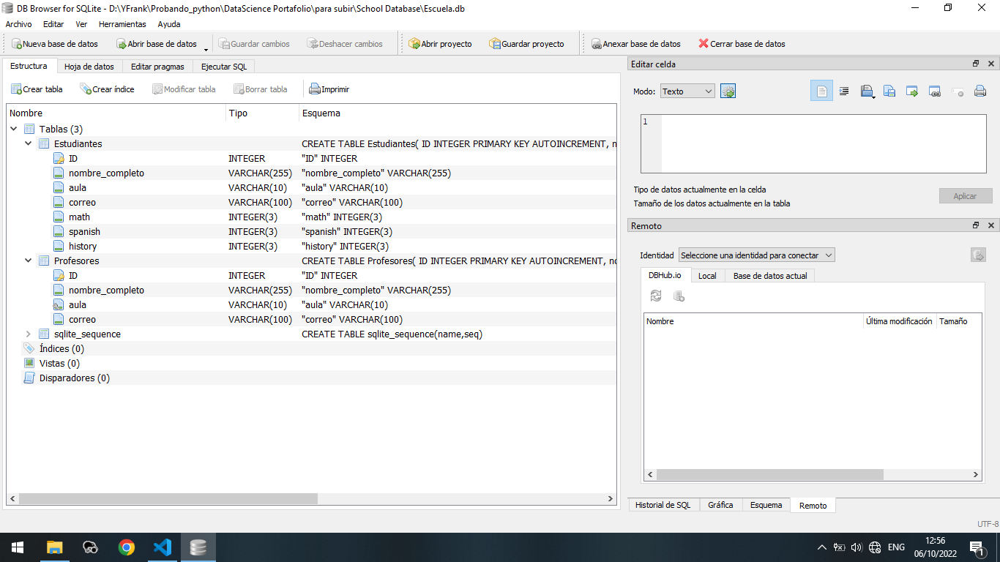

```python
import sqlite3

def create_table():
   
    con=sqlite3.connect('Escuela.db')  #Create a database or connect to one

    c= con.cursor()            #Create cursor
    
    c.execute("CREATE TABLE IF NOT EXISTS Estudiantes(\
        ID INTEGER PRIMARY KEY AUTOINCREMENT,\
        nombre_completo VARCHAR(255),\
        aula VARCHAR(10),\
        correo VARCHAR(100),\
        math INTEGER(3),\
        spanish INTEGER(3),\
        history INTEGER(3))")

    c.execute("CREATE TABLE IF NOT EXISTS Profesores(\
        ID INTEGER PRIMARY KEY AUTOINCREMENT,\
        nombre_completo VARCHAR(255),\
        aula VARCHAR(10),\
        correo VARCHAR(100),\
        FOREIGN KEY(aula) REFERENCES Estudiantes(aula))")
         
    con.commit()
    c.close()
```

## Create a visual interface using Tkinter.

```python
from tkinter import *
from tkinter import ttk

root=Tk()       

root.title("School Database")   #Title of the aplication
root.iconbitmap("logo1.ico")    #Seting an ico to the aplication

root.mainloop()

```
## Create a login window.

The user and password are not allowed to change. It's neccesary to get access to source code to know the credentials.


```python   
from PIL import Image,ImageTk

def auth():         #Checking the credentianls
    if e_user.get()=="Admin" and e_password.get()=="ThisIsAStrongPassword":
        is_admin()
        return
    else:
        messagebox.showerror("ERROR", "Usuario o clave incorrecta. Introduzca nuevamente sus credenciales.")
        e_user.delete(0,END)
        e_password.delete(0,END)

def login():
    create_table()
    app_width=500
    app_height=300
    screen_width=root.winfo_screenwidth()           #Monitor width
    screen_height=root.winfo_screenheight()         #Monitor height
    x=(screen_width/2)-(app_width/2)                
    y=(screen_height/2)-(app_height/2)
    root.geometry(f"{app_width}x{app_height}+{int(x)}+{int(y)}")    #Center login window

    global l_frame_user_auth
    
    l_frame_user_auth=LabelFrame(root,width=275,height=350,background=ModuleColor,bd=3,font=("Bahnschrift Condensed",12))
    l_frame_user_auth.pack(side=LEFT,fill=Y)

    global mylogo
    mylogo=ImageTk.PhotoImage(Image.open("logo1.png").resize((100,100)))
    mylabel=Label(l_frame_user_auth,image=mylogo,borderwidth=0,bg=ModuleColor)
    mylabel.pack(pady=80,padx=50)
    
    #anchoFLeft=500-l_frame_user_auth.__getitem__("width")
    global RightFrame
    RightFrame=LabelFrame(root,width=225,height=700,background=QuesColor,text="Iniciar Sesión",bd=3,font=("Bahnschrift Condensed",12))
    RightFrame.pack(side=RIGHT,fill=BOTH,expand=1)

    global l_user
    l_user=Label(RightFrame,text="Name",bg=QuesColor,font=("Bahnschrift Condensed",15))
    l_user.pack(pady=(50,0))

    global e_user
    e_user= Entry(RightFrame,font=("Bahnschrift Condensed",13))
    e_user.pack()
    
    global l_password
    l_user=Label(RightFrame,text="Password",bg=QuesColor,font=("Bahnschrift Condensed",15))
    l_user.pack(pady=(10,0))

    global e_password
    e_password= Entry(RightFrame,font=("Bahnschrift Condensed",13))
    e_password.config(show="*")         #Hidden the password input
    e_password.pack()
    
    global mybtnloginimg
    mybtnloginimg=ImageTk.PhotoImage(Image.open("submit1.png").resize((150,150)))
    check_user_btn=Button(RightFrame,image=mybtnloginimg,command=auth,cursor="hand2",borderwidth=0,bg=QuesColor)
    check_user_btn.pack(pady=20)
    
login()
```
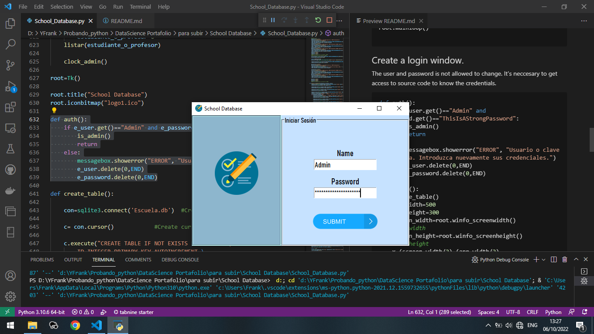

## Create a main window if credentials are correct.

```python

TABLE_NAME={0:"Estudiantes",1:"Profesores"}

TABLAS_A_TRABAJAR=["Listar Profesores","Listar Estudiantes"]

TABLAS_A_ELIMINAR=["Estudiantes","Profesores"]


def clear_panel2_and_panelleft():
    
    for widget in root.winfo_children():
        widget.destroy()
    login()

def is_admin():
    RightFrame.pack_forget()
    l_frame_user_auth.pack_forget()
        
    screen_width=root.winfo_screenwidth()
    screen_height=root.winfo_screenheight()

    x=(screen_width/2)-(screen_width/2)
    y=(screen_height/2)-(screen_height/2)
    root.geometry(f"{screen_width}x{screen_height}+{int(x)}+{int(y)}")
    #root.geometry("%dx%d" % (screen_width, screen_height))
    
    global Panel_admin_left
    Panel_admin_left=PanedWindow(bd=4,relief="raised",bg=PANEL_LEFT_COLOR)
    Panel_admin_left.pack(fill=BOTH,expand=1)
    
    # #Creando frame
    my_frame_admin1=Frame(Panel_admin_left,bg=PANEL_LEFT_COLOR,height=60)

    #Close sesion button
    global mybtnclosesessionimg
    mybtnclosesessionimg=ImageTk.PhotoImage(Image.open("lo2.png").resize((80,80)))
    regresar_login=Button(my_frame_admin1,cursor="hand2",bg=PANEL_LEFT_COLOR,borderwidth=0,activebackground=PANEL_LEFT_COLOR, image=mybtnclosesessionimg,command=clear_panel2_and_panelleft)
    regresar_login.pack(pady=10)

    panel_2=Frame(my_frame_admin1,bg=PANEL_LEFT_COLOR)
    panel_2.pack(fill=BOTH,expand=YES,pady=(40,0))
    s2=Label(panel_2,text="Tablas",bg=PANEL_LEFT_COLOR,font=("Bahnschrift Condensed",14)).pack()
    
    global mylistbox_admin2
    
    mylistbox_admin2=Listbox(panel_2,width=20,activestyle="underline",justify=CENTER,height=0,bg="dark slate gray",fg="white",cursor="hand2",font=("Bahnschrift Condensed",14))

    mylistbox_admin2.bind("<Double-1>",tablas_de_trabajo)
    mylistbox_admin2.pack()
 
    for elements in TABLAS_A_TRABAJAR:
        mylistbox_admin2.insert(END,elements)

    my_frame_admin1.pack(ipadx=10)
    Panel_admin_left.add(my_frame_admin1)
       
    global panel2_admin

    pan2=Frame(Panel_admin_left,relief="raised",bg=BORDER_FRAMERIGHT_COLOR)
    Panel_admin_left.add(pan2)

    global my_canvas
    my_canvas=Canvas(pan2,bg=PANEL_RIGHT_COLOR)
    my_canvas.pack(side=LEFT,fill=BOTH,expand=1)

    my_scroll_bar=ttk.Scrollbar(Panel_admin_left,orient=VERTICAL,command=my_canvas.yview)
    my_scroll_bar.pack(side=RIGHT, fill=Y)

    my_canvas.configure(yscrollcommand=my_scroll_bar.set)
    my_canvas.bind('<Configure>',lambda e:my_canvas.configure(scrollregion=my_canvas.bbox("all")))

    panel2_admin=Frame(my_canvas,bg=PANEL_RIGHT_COLOR)

    my_canvas.create_window((0,0),window=panel2_admin,anchor="nw")
    
    
    panel_3=Frame(my_frame_admin1,bg=PANEL_LEFT_COLOR)
    panel_3.pack(fill=BOTH,expand=YES)
    s3=Label(panel_3,text="Eliminar Tablas",bg=PANEL_LEFT_COLOR,font=("Bahnschrift Condensed",14)).pack()
    global mylistbox_admin3
 
    mylistbox_admin3=Listbox(panel_3,width=20,justify=CENTER,height=0,bg="dark slate gray",fg="white",cursor="hand2",font=("Bahnschrift Condensed",14))
  
    mylistbox_admin3.bind("<Double-1>",Eliminar_tabla)
    mylistbox_admin3.pack()
    
    for elements_to_delete in TABLAS_A_ELIMINAR:
        mylistbox_admin3.insert(END,elements_to_delete)
    
    clock_admin()
```


## Create a clock widget.

```python
import time
def clock_admin():
    global my_time
    my_time=Label(my_canvas,text="",bg="white",font=("Bahnschrift Condensed",13),fg="dark slate gray",bd=4,relief="groove",width=10)
    my_time.place(x=1070,y=20)  #Position of the clock widget in the screen
    hour=time.strftime("%I")            
    minute=time.strftime("%M")
    second=time.strftime("%S")
    am_pm=time.strftime("%p")
    my_time.config(text=hour+":"+minute+":"+second+" "+am_pm)
    my_time.after(1000,clock_admin)
```

The following picture shows the distribution of the widget created until now in the screen

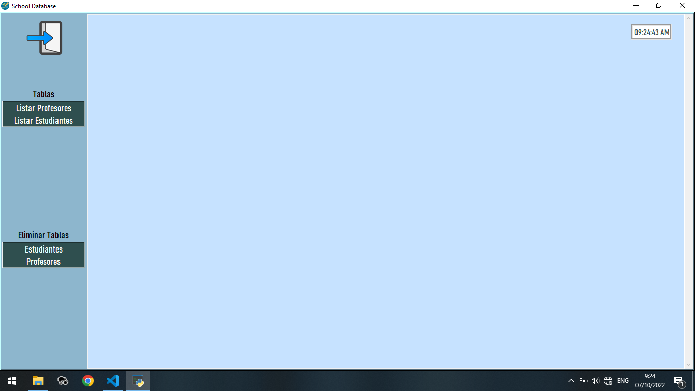


## Allow to users save the information of students and teachers in csv or excels files

```python
import pandas as pd
import csv

def write_to_excel(estudiante_o_profesor,resultado):
    if estudiante_o_profesor==0:
        resultado.insert(0,("ID","Nombre y Apellidos","Aula","Correo", "Matemáticas", "Español","Historia"))
    else:
        resultado.insert(0,("ID","Nombre y Apellidos","Aula","Correo"))
    l=[]
    for elements in resultado[1:]:
        (a,*restresultado)=elements
        l.append(restresultado)
    df=pd.DataFrame(l,columns=resultado[0][1:])
    df.to_excel(f"{TABLE_NAME[estudiante_o_profesor]}.xlsx",index=False)
    
def write_to_csv(estudiante_o_profesor,resultado):
    if estudiante_o_profesor==0:
        resultado.insert(0,("ID","Nombre y Apellidos","Aula","Correo", "Matemáticas", "Español","Historia"))
    else:
        resultado.insert(0,("ID","Nombre y Apellidos","Aula","Correo"))
    #El codigo de abajo convierte a csv
    with open(f"{TABLE_NAME[estudiante_o_profesor]}.csv",'a',newline="") as f:
        w=csv.writer(f, dialect="excel")
        for i in resultado:
            w.writerow(i)
```
## Create the CRUD (Create,Read,Update and Delete) for both tables.
    * Analize the number of students that fail his tests of "Matemáticas","Español" or "Historia"
    * Analize the AVG (average) in "Matemáticas","Español" or "Historia"
    * Analize the number of students that score more of 95 points in his tests of "Matemáticas","Español" or "Historia"
    * Create new students or teachers
    * Read elements  
    * Update students or teachers information
    * Delete students or teachers of the table
    * Sort students or teachers information 

For best comprehension I will split the explanation in two differents parts. One will be the code that build the visual interface and another the processing of the actions (SQL sentences in Python code).

- Create new students or teachers
   * Visual Interface 

```python        
def new_teacher_or_student(estudiante_o_profesor):
    global top_add
    top_add=Toplevel(panel2_admin,bg=PANEL_RIGHT_COLOR)
    top_add.title("Agregar Nuevo Profesor")
    top_add.geometry("320x200")
    top_add.iconbitmap("logo1.ico")
    label_nombre_completo=Label(top_add,text="Nombre Completo",bg=PANEL_RIGHT_COLOR,font=("Bahnschrift Condensed",14))
    label_nombre_completo.grid(column=0,row=0,pady=(10,0),padx=5)
    global f_nombre_completo
    f_nombre_completo=Entry(top_add,font=("Bahnschrift Condensed",13))
    f_nombre_completo.grid(column=1,row=0,pady=(10,0),padx=5)
    
    label_aula=Label(top_add,text="Aula",bg=PANEL_RIGHT_COLOR,font=("Bahnschrift Condensed",14))
    label_aula.grid(column=0,row=1,pady=(10,0),padx=5)
    global f_aula
    f_aula=Entry(top_add,font=("Bahnschrift Condensed",13))
    f_aula.grid(column=1,row=1,pady=(10,0),padx=5)
    
    label_correo=Label(top_add,text="Correo",bg=PANEL_RIGHT_COLOR,font=("Bahnschrift Condensed",14))
    label_correo.grid(column=0,row=2,pady=(10,0),padx=5)
    global f_correo
    f_correo=Entry(top_add,font=("Bahnschrift Condensed",13))
    f_correo.grid(column=1,row=2,pady=(10,0),padx=5)
    if estudiante_o_profesor==0:
        top_add.title("Agregar Nuevo Estudiante")
        top_add.geometry("320x320")
        label_nota_spanish=Label(top_add,text="Nota en Español",bg=PANEL_RIGHT_COLOR,font=("Bahnschrift Condensed",14))
        label_nota_spanish.grid(column=0,row=3,pady=(10,0),padx=5)
        global f_nota_spanish
        f_nota_spanish=Entry(top_add,font=("Bahnschrift Condensed",13))
        f_nota_spanish.grid(column=1,row=3,pady=(10,0),padx=5)
        
        label_nota_math=Label(top_add,text="Nota en Matemática",bg=PANEL_RIGHT_COLOR,font=("Bahnschrift Condensed",14))
        label_nota_math.grid(column=0,row=4,pady=(10,0),padx=5)
        global f_nota_math
        f_nota_math=Entry(top_add,font=("Bahnschrift Condensed",13))
        f_nota_math.grid(column=1,row=4,pady=(10,0),padx=5) 
        
        label_nota_history=Label(top_add,text="Nota en Historia",bg=PANEL_RIGHT_COLOR,font=("Bahnschrift Condensed",14))
        label_nota_history.grid(column=0,row=5,pady=(10,0),padx=5)
        global f_nota_history
        f_nota_history=Entry(top_add,font=("Bahnschrift Condensed",13))
        f_nota_history.grid(column=1,row=5,pady=(10,0),padx=5)
    
    global mybtnagreeimg
    mybtnagreeimg=ImageTk.PhotoImage(Image.open("aplicar1.png").resize((50,50)))
    submit_btn=Button(top_add,activebackground=PANEL_RIGHT_COLOR,cursor="hand2",image=mybtnagreeimg,borderwidth=0,bg=PANEL_RIGHT_COLOR,command=lambda:submit_teacher_or_student(estudiante_o_profesor))
    submit_btn.grid(column=1,row=6,pady=(10,0),padx=5)  
```
The following picture shows the windows of create new students and teachers

<p align="center">
    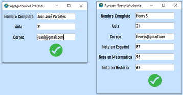
</p>

The following picture shows the error message inputs by blanck fields or no students in a group when a professor is created.

<p align="center">
    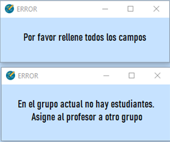
</p>

- Create new students or teachers
    * Processing of the actions (SQL sentences in Python code)


```python     
def rellene_todos_los_campos():
    top = Toplevel()
    top.title("ERROR")
    top.iconbitmap("logo1.ico")
    top.geometry("300x100")
    warnlbl=Label(top, text="Por favor rellene todos los campos",pady=20,padx=20)
    warnlbl.pack()
    return 

def aula_sin_estudiantes():
    top = Toplevel(bg=PANEL_RIGHT_COLOR)
    top.title("ERROR")
    top.iconbitmap("logo1.ico")
    top.geometry("300x100")
    warnlbl=Label(top,bg=PANEL_RIGHT_COLOR, text="En el grupo actual no hay estudiantes.\n Asigne al profesor a otro grupo",pady=20,padx=20)
    warnlbl.pack()
    f_aula.delete(0,END)

def submit_teacher_or_student(estudiante_o_profesor):
    con=sqlite3.connect('Escuela.db')  #Create a database or connect to one

    c= con.cursor()            #Create cursor   
    
    if estudiante_o_profesor==0 and (f_nombre_completo.get()!="" or f_aula.get()!=""  or f_correo.get()!=""):
        if f_nota_math.get()=="" or f_nota_spanish.get()=="" or f_nota_history.get()=="":
            rellene_todos_los_campos()
        else:
            c.execute("INSERT INTO Estudiantes VALUES(NULL,:nombre_completo,:aula,:correo,:math,:spanish,:history)",
              {'nombre_completo':f_nombre_completo.get(),
               'aula':f_aula.get(),
               'correo':f_correo.get(),
               'math':f_nota_math.get(),
               'spanish':f_nota_spanish.get(),
               'history':f_nota_history.get()
               }
              )                       #Insertar en tabla
            #Limpiar cuadros de texto
            f_nombre_completo.delete(0,END)
            f_aula.delete(0,END)
            f_correo.delete(0,END)
            f_nota_math.delete(0,END) 
            f_nota_spanish.delete(0,END)   
            f_nota_history.delete(0,END)
            con.commit()
            c.close()
            listar(estudiante_o_profesor)
    elif f_nombre_completo.get()=="" or f_aula.get()==""  or f_correo.get()=="":
        rellene_todos_los_campos()
    else:
        c.execute("SELECT COUNT(aula) FROM Estudiantes WHERE aula = '{}' ".format(f_aula.get()))
        r=c.fetchall()
        if r[0][0]!=0:
            c.execute("INSERT INTO Profesores VALUES(NULL,:nombre_completo,:aula,:correo)",
                {'nombre_completo':f_nombre_completo.get(),
                'aula':f_aula.get(),
                'correo':f_correo.get()
                }
                )                       #Insertar en tabla
            #Limpiar cuadros de texto
            f_nombre_completo.delete(0,END)
            f_aula.delete(0,END)
            f_correo.delete(0,END)
            con.commit()
            c.close()
            listar(estudiante_o_profesor)
        else:
            aula_sin_estudiantes()
```


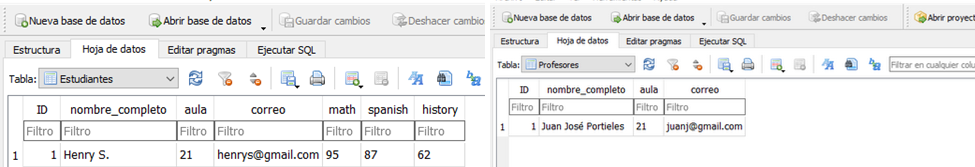

- Read elements and Sort students or teachers information 
    * Visual Interface

With the goal of better visualization of the data and the actions of the buttons I insert more data in the tables.


```python
def mostrar_en_pantalla(estudiante_o_profesor,result):    
    ordenarid_btn=Button(panel2_admin,font=FONT_BUTTON,cursor="hand2",text="ID↑↓",command=lambda:ordenar(estudiante_o_profesor,"ID"))
    ordenarid_btn.grid(column=0,row=2,padx=(5,0))
    
    ordenarname_btn=Button(panel2_admin,font=FONT_BUTTON,cursor="hand2",text="Nombre y Apellidos↑↓",command=lambda:ordenar(estudiante_o_profesor,"nombre_completo"))
    ordenarname_btn.grid(column=1,row=2,padx=(5,0))

    ordenaraula_btn=Button(panel2_admin,font=FONT_BUTTON,cursor="hand2",text="Aula↑↓",command=lambda:ordenar(estudiante_o_profesor,"aula"))
    ordenaraula_btn.grid(column=2,row=2)     
    
    ordenarcorreo_btn=Button(panel2_admin,font=FONT_BUTTON,cursor="hand2",text="Correo↑↓",command=lambda:ordenar(estudiante_o_profesor,"correo"))
    ordenarcorreo_btn.grid(column=3,row=2)  
    criterios_de_busqueda=["Buscar...","Nombre y Apellidos","Aula","Correo"]
    if estudiante_o_profesor==0: 
        criterios_de_busqueda=["Buscar...","Nombre y Apellidos","Aula","Correo","Español","Matemática","Historia"]
        ordenaraula_btn=Button(panel2_admin,font=FONT_BUTTON,cursor="hand2",text="Matemáticas↑↓",command=lambda:ordenar(estudiante_o_profesor,"math"),bg=MATH_FRAME_BACKGROUNDCOLOR_HEADER,activebackground=MATH_FRAME_BACKGROUNDCOLOR_HEADER)
        ordenaraula_btn.grid(column=4,row=2)    

        ordenaraula_btn=Button(panel2_admin,font=FONT_BUTTON,cursor="hand2",text="Español↑↓",command=lambda:ordenar(estudiante_o_profesor,"spanish"),bg=SPANISH_FRAME_BACKGROUNDCOLOR_HEADER,activebackground=SPANISH_FRAME_BACKGROUNDCOLOR_HEADER)
        ordenaraula_btn.grid(column=5,row=2) 
        
        ordenaraula_btn=Button(panel2_admin,font=FONT_BUTTON,cursor="hand2",text="Historia↑↓",command=lambda:ordenar(estudiante_o_profesor,"history"),bg=HISTORY_FRAME_BACKGROUNDCOLOR_HEADER,activebackground=HISTORY_FRAME_BACKGROUNDCOLOR_HEADER)
        ordenaraula_btn.grid(column=6,row=2)
        
    global buscar_btn_combo
    buscar_btn_combo=ttk.Combobox(panel2_admin,font=FONT_BUTTON, values=criterios_de_busqueda) 
    buscar_btn_combo.current(0)       
    buscar_btn_combo.grid(row=0,column=1,pady=10,padx=(15,0),ipadx=6)
    global f_busqueda
    f_busqueda=Entry(panel2_admin)
    f_busqueda.grid(row=0,column=2,pady=10,padx=8)
    
    global mybtnsearchimg
    mybtnsearchimg=ImageTk.PhotoImage(Image.open("search6.png").resize((30,30)))
    global buscar_btn
    buscar_btn=Button(panel2_admin,cursor="hand2",activebackground=PANEL_RIGHT_COLOR,image=mybtnsearchimg,borderwidth=0,bg=PANEL_RIGHT_COLOR,command=lambda:buscar_ahora(estudiante_o_profesor))
    buscar_btn.place(x=465,y=10)
    
    global mybtnaddimg
    mybtnaddimg=ImageTk.PhotoImage(Image.open("plus3.png").resize((50,50)))
    global agregar_estudiante_btn
    agregar_estudiante_btn=Button(panel2_admin,activebackground=PANEL_RIGHT_COLOR,cursor="hand2",image=mybtnaddimg,borderwidth=0,bg=PANEL_RIGHT_COLOR,command=lambda:new_teacher_or_student(estudiante_o_profesor))
    agregar_estudiante_btn.place(x=150,y=39)
    l=[]
    for index,x in enumerate(result):
        num=0
        index+=3
        id_reference=str(x[0])

        for y in x:
            l_mostrar=Label(panel2_admin, text=y,bg=PANEL_RIGHT_COLOR,font=("Bahnschrift Condensed",13))
            l_mostrar.grid(row=index, column=num, padx=(5,0))
            num+=1
        l.append(id_reference)
    button_dict_editar={}
    button_dict_eliminar={}
    global mybtneditimg
    mybtneditimg=ImageTk.PhotoImage(Image.open("edit10.png").resize((30,30)))
    global mybtndeleteimg
    mybtndeleteimg=ImageTk.PhotoImage(Image.open("c3.png").resize((30,30)))
    for e in range(len(l)):
        def func_editar(x=l[e]):
            return editar_ahora(estudiante_o_profesor,x)
        def func_eliminar(x=l[e]):
            return eliminar_ahora(estudiante_o_profesor,x)
 
        button_dict_editar[e]=Button(panel2_admin,activebackground=PANEL_RIGHT_COLOR,cursor="hand2", image=mybtneditimg,borderwidth=0,bg=PANEL_RIGHT_COLOR,command = func_editar)
        button_dict_editar[e].grid(row = e+3, column = 8, padx = (5,0), pady = 5) 
        button_dict_eliminar[e]=Button(panel2_admin,activebackground=PANEL_RIGHT_COLOR,cursor="hand2", image=mybtndeleteimg,borderwidth=0,bg=PANEL_RIGHT_COLOR,command =func_eliminar)
        button_dict_eliminar[e].grid(row = e+3, column = 9, padx = (5,0), pady = 5)
    csv_btn=Button(panel2_admin,activebackground=CSV_BUTTON_BACKGROUNDCOLOR,font=FONT_BUTTON,cursor="hand2",bg=CSV_BUTTON_BACKGROUNDCOLOR, text="Guardar en un CSV",command = lambda: write_to_csv(estudiante_o_profesor,result))        
    csv_btn.grid(row=0,column=0,pady=(10,0),padx=(10,0),ipadx=10)
    
    excel_btn=Button(panel2_admin,activebackground=EXCEL_BUTTON_BACKGROUNDCOLOR,font=FONT_BUTTON,cursor="hand2",bg=EXCEL_BUTTON_BACKGROUNDCOLOR, text="Guardar en un Excel",command = lambda: write_to_excel(estudiante_o_profesor,result))        
    excel_btn.grid(row=1,column=0,pady=8,padx=(10,0),ipadx=6)

def listar(estudiante_o_profesor):
    clear_panel2()
    clock_admin()
    con=sqlite3.connect('Escuela.db')    #Create a database or connect to one
    c= con.cursor()                     #Create cursor
    c.execute(f"SELECT * FROM {TABLE_NAME[estudiante_o_profesor]}")
    registros=c.fetchall()
    if estudiante_o_profesor==0:
        estadisticas_asignaturas()
        
    else:
        for widget in my_canvas.winfo_children():
            if widget!=panel2_admin and widget!=my_time:
                widget.destroy()
    mostrar_en_pantalla(estudiante_o_profesor,registros)
    con.commit()
    c.close()

def tablas_de_trabajo(valor):
    clear_panel2()
    target_student_options=mylistbox_admin2.get(ANCHOR)

    if target_student_options=="Listar Profesores":
        estudiante_o_profesor=1    
    else:
        estudiante_o_profesor=0
    listar(estudiante_o_profesor)
    
    clock_admin()
```
- ## Stadistics
    * Analize the number of students that fail his tests of "Matemáticas","Español" or "Historia"
    * Analize the AVG (average) in "Matemáticas","Español" or "Historia"
    * Analize the number of students that score more of 95 points in his tests of "Matemáticas","Español" or "Historia"

```python
def metodos_estadisticos(asignatura,filtrado_por_aula=False):
    con=sqlite3.connect('Escuela.db')
    asignatura_cursor_avg=con.cursor()
    lista_valores=[]
    if filtrado_por_aula==False:
        asignatura_cursor_avg.execute(f"SELECT round(AVG({asignatura}),2) FROM Estudiantes")
        lista_valores.append(asignatura_cursor_avg.fetchall())
        asignatura_cursor_avg.execute(f"SELECT COUNT({asignatura}) FROM Estudiantes WHERE math < 60")
        lista_valores.append(asignatura_cursor_avg.fetchall())
        asignatura_cursor_avg.execute(f"SELECT COUNT({asignatura}) FROM Estudiantes WHERE math >= 95")
        lista_valores.append(asignatura_cursor_avg.fetchall())
        
    else:
        asignatura_cursor_avg.execute(f"SELECT round(AVG({asignatura}),2) FROM Estudiantes WHERE aula = {str(f_busqueda.get())}")
        lista_valores.append(asignatura_cursor_avg.fetchall())
        asignatura_cursor_avg.execute(f"SELECT COUNT({asignatura}) FROM Estudiantes WHERE math < 60 AND aula = {str(f_busqueda.get())}")
        lista_valores.append(asignatura_cursor_avg.fetchall())
        asignatura_cursor_avg.execute(f"SELECT COUNT({asignatura}) FROM Estudiantes WHERE math >= 95 AND aula = {str(f_busqueda.get())}")
        lista_valores.append(asignatura_cursor_avg.fetchall())
    con.commit()
    asignatura_cursor_avg.close()
    return lista_valores   
def estadisticas_asignaturas(filtrado_por_aula=False):

    ####" Estadísticas en Matemáticas "####
       
    mathframe=Frame(my_canvas,bg=MATH_FRAME_BACKGROUNDCOLOR,width=300,height=300)
    mathframe.place(x=910,y=80)
    
    global mybtnmathimg
    mybtnmathimg=ImageTk.PhotoImage(Image.open("math1.png").resize((50,50)))
   
    stadisticsmath=Label(mathframe,bg=MATH_FRAME_BACKGROUNDCOLOR_HEADER,font=("Bahnschrift Condensed",14),text=" Estadísticas en Matemáticas ",image=mybtnmathimg,borderwidth=0,compound="right")
    stadisticsmath.grid(row=0,column=0)
    
    resp_dmath=metodos_estadisticos("math",filtrado_por_aula)[0]
    
    label_avg_math=Label(mathframe,bg=MATH_FRAME_BACKGROUNDCOLOR,text="Promedio de las Notas (AVG): "+ str(resp_dmath[0][0]),font=("Bahnschrift Condensed",14))
    label_avg_math.grid(row=1,column=0,sticky=W)

    resp_smath=metodos_estadisticos("math",filtrado_por_aula)[1]
   
    label_s_math=Label(mathframe,bg=MATH_FRAME_BACKGROUNDCOLOR,text="Suspensos en la Asignatura(< 60): "+ str(resp_smath[0][0]),font=("Bahnschrift Condensed",14))
    label_s_math.grid(row=2,column=0,sticky=W)

    resp_gmath=metodos_estadisticos("math",filtrado_por_aula)[2]

    label_g_math=Label(mathframe,bg=MATH_FRAME_BACKGROUNDCOLOR,text="Mayores de 95 Puntos: "+ str(resp_gmath[0][0]),font=("Bahnschrift Condensed",14))
    label_g_math.grid(row=3,column=0,sticky=W)

    ####"Fin Estadísticas en Matemáticas "####
        
    ####"Estadísticas en Español "####
    spanishframe=Frame(my_canvas,bg=SPANISH_FRAME_BACKGROUNDCOLOR,width=320,height=300)
    spanishframe.place(x=910,y=250)
    
    global mybtnspanishimg
    mybtnspanishimg=ImageTk.PhotoImage(Image.open("abct.png").resize((45,50)))
   
    stadisticsspanish=Label(spanishframe,bg=SPANISH_FRAME_BACKGROUNDCOLOR_HEADER,font=("Bahnschrift Condensed",14),text="     Estadísticas en Español       ",image=mybtnspanishimg,borderwidth=0,compound="right")
    stadisticsspanish.grid(row=0,column=0)
    
    resp_dspanish=metodos_estadisticos("spanish",filtrado_por_aula)[0]
    label_avg_spanish=Label(spanishframe,bg=SPANISH_FRAME_BACKGROUNDCOLOR,text="Promedio de las Notas (AVG): "+ str(resp_dspanish[0][0])+"   ",font=("Bahnschrift Condensed",14))
    label_avg_spanish.grid(row=1,column=0,sticky=W)
  
    resp_sspanish=metodos_estadisticos("spanish",filtrado_por_aula)[1]
    label_s_spanish=Label(spanishframe,bg=SPANISH_FRAME_BACKGROUNDCOLOR,text="Suspensos en la Asignatura(< 60): "+ str(resp_sspanish[0][0])+"   ",font=("Bahnschrift Condensed",14))
    label_s_spanish.grid(row=2,column=0,sticky=W)
   
    resp_gspanish=metodos_estadisticos("spanish",filtrado_por_aula)[2]
    label_g_spanish=Label(spanishframe,bg=SPANISH_FRAME_BACKGROUNDCOLOR,text="Mayores de 95 Puntos: "+ str(resp_gspanish[0][0])+"   ",font=("Bahnschrift Condensed",14))
    label_g_spanish.grid(row=3,column=0,sticky=W)

    ####"Fin Estadísticas en Español "####
    
    ####"Estadísticas en Historia "####
    historyframe=Frame(my_canvas,bg=HISTORY_FRAME_BACKGROUNDCOLOR,width=320,height=300)
    historyframe.place(x=910,y=420)
    
    global mybtnhistoryimg
    mybtnhistoryimg=ImageTk.PhotoImage(Image.open("h3.png").resize((45,50)))
   
    stadisticshistory=Label(historyframe,bg=HISTORY_FRAME_BACKGROUNDCOLOR_HEADER,font=("Bahnschrift Condensed",14),text="     Estadísticas en Historia       ",image=mybtnhistoryimg,borderwidth=0,compound="right")
    stadisticshistory.grid(row=0,column=0)
    
    resp_dhistory=metodos_estadisticos("history",filtrado_por_aula)[0]
    label_avg_math=Label(historyframe,text="Promedio de las Notas (AVG): "+ str(resp_dhistory[0][0]),bg=HISTORY_FRAME_BACKGROUNDCOLOR,font=("Bahnschrift Condensed",14))
    label_avg_math.grid(column=0,row=1,sticky=W)
    
    resp_shistory=metodos_estadisticos("history",filtrado_por_aula)[1]
    label_s_history=Label(historyframe,bg=HISTORY_FRAME_BACKGROUNDCOLOR,text="Suspensos en la Asignatura(< 60): "+ str(resp_shistory[0][0])+"   ",font=("Bahnschrift Condensed",14))
    label_s_history.grid(row=2,column=0,sticky=W)
    
    resp_ghistory=metodos_estadisticos("history",filtrado_por_aula)[2]
    label_g_history=Label(historyframe,bg=HISTORY_FRAME_BACKGROUNDCOLOR,text="Mayores de 95 Puntos: "+ str(resp_ghistory[0][0])+"   ",font=("Bahnschrift Condensed",14))
    label_g_history.grid(row=3,column=0,sticky=W)
  
    ####"Fin Estadísticas en Historia "####

```
- Read elements
    * Processing of the actions (SQL sentences in Python code)
```python
def buscar_ahora(estudiante_o_profesor):
    global l_mostrar
    for widget in panel2_admin.winfo_children():
        if widget not in [f_busqueda,buscar_btn_combo,buscar_btn,agregar_estudiante_btn]:
            widget.destroy()
    for widget in my_canvas.winfo_children():
        if widget!=panel2_admin and widget!=my_time:
            widget.destroy()
    con=sqlite3.connect('Escuela.db')    #Create a database or connect to one
    c= con.cursor()                     #Create cursor 
    selected = buscar_btn_combo.get()
    
    if selected=="Buscar...":
        messagebox.showerror("Error","Olvidaste seleccionar tu criterio de búsqueda")
        listar(estudiante_o_profesor)
    elif selected=="Nombre y Apellidos":
        c.execute(f"SELECT * FROM {TABLE_NAME[estudiante_o_profesor]} WHERE nombre_completo = '{f_busqueda.get()}'")
        
    elif selected=="Aula":
        c.execute(f"SELECT * FROM {TABLE_NAME[estudiante_o_profesor]} WHERE aula = '{f_busqueda.get()}'")
        if estudiante_o_profesor==0:
            estadisticas_asignaturas(filtrado_por_aula=True)
    elif selected=="Correo":
        c.execute(f"SELECT * FROM {TABLE_NAME[estudiante_o_profesor]} WHERE correo = '{f_busqueda.get()}'")
    elif selected=="Español":
        c.execute(f"SELECT * FROM {TABLE_NAME[estudiante_o_profesor]} WHERE spanish = {f_busqueda.get()}")
        
    elif selected=="Matemática":
        c.execute(f"SELECT * FROM {TABLE_NAME[estudiante_o_profesor]} WHERE math = {f_busqueda.get()}")
    else:
        c.execute(f"SELECT * FROM {TABLE_NAME[estudiante_o_profesor]} WHERE history = {f_busqueda.get()}")
                    
    result=c.fetchall()
    mostrar_en_pantalla(estudiante_o_profesor,result)
       
    con.commit()
    c.close() 
                     
    clock_admin()
```


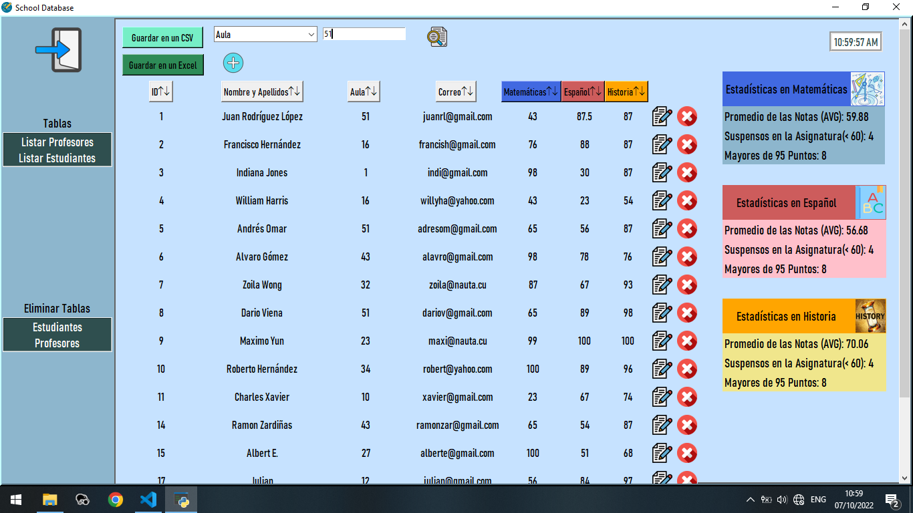

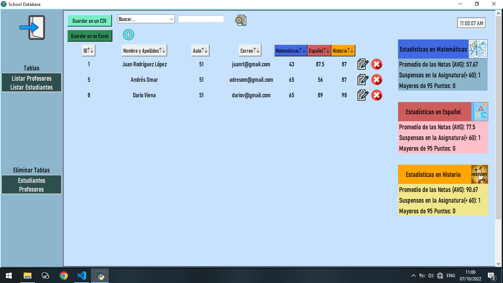

- Update students or teachers information
    * Visual Interface

```python
def editar_ahora(estudiante_o_profesor,id_reference):
    
    top=Toplevel(panel2_admin,bg=PANEL_RIGHT_COLOR)
    top.title("Editando registro con ID "+ str(id_reference))
    top.iconbitmap("logo1.ico")
    
    top.geometry("400x200")
    label_nombre_completo_estudiante_top=Label(top,text="Nombre Completo",bg=PANEL_RIGHT_COLOR,font=("Bahnschrift Condensed",14))
    label_nombre_completo_estudiante_top.grid(column=0,row=0,pady=(20,5),sticky=W,padx=40)
    global f_nombre_completo_top
    f_nombre_completo_top=Entry(top,font=("Bahnschrift Condensed",13))
    f_nombre_completo_top.grid(column=1,row=0,pady=(20,5),sticky=E)
    
    label_aula_top=Label(top,text="Aula",bg=PANEL_RIGHT_COLOR,font=("Bahnschrift Condensed",14))
    label_aula_top.grid(column=0,row=1,sticky=W,pady=5,padx=40)
    global f_aula_top
    f_aula_top=Entry(top,font=("Bahnschrift Condensed",13))
    f_aula_top.grid(column=1,row=1,sticky=E)
    
    label_correo_top=Label(top,text="Correo",bg=PANEL_RIGHT_COLOR,font=("Bahnschrift Condensed",14))
    label_correo_top.grid(column=0,row=2,sticky=W,pady=5,padx=40)
    global f_correo_top
    f_correo_top=Entry(top,font=("Bahnschrift Condensed",13))
    f_correo_top.grid(column=1,row=2,pady=5,sticky=E)
    if estudiante_o_profesor==0:
        top.geometry("400x320")
        label_nota_spanish_top=Label(top,text="Nota en Español",bg=PANEL_RIGHT_COLOR,font=("Bahnschrift Condensed",14))
        label_nota_spanish_top.grid(column=0,row=3,sticky=W,pady=5,padx=40)
        global f_nota_spanish_top
        f_nota_spanish_top=Entry(top,font=("Bahnschrift Condensed",13))
        f_nota_spanish_top.grid(column=1,row=3,sticky=W,pady=5)
        
        label_nota_math_top=Label(top,text="Nota en Matemática",bg=PANEL_RIGHT_COLOR,font=("Bahnschrift Condensed",14))
        label_nota_math_top.grid(column=0,row=4,sticky=W,pady=5,padx=40)
        global f_nota_math_top
        f_nota_math_top=Entry(top,font=("Bahnschrift Condensed",13))
        f_nota_math_top.grid(column=1,row=4,sticky=W,pady=5)
        
        label_nota_history_top=Label(top,text="Nota en Historia",bg=PANEL_RIGHT_COLOR,font=("Bahnschrift Condensed",14))
        label_nota_history_top.grid(column=0,row=5,sticky=W,pady=5,padx=40)
        global f_nota_history_top
        f_nota_history_top=Entry(top,font=("Bahnschrift Condensed",13))
        f_nota_history_top.grid(column=1,row=5,sticky=W,pady=5)
  
    con=sqlite3.connect('Escuela.db')    #Create a database or connect to one
    c= con.cursor()                     #Create cursor
    
    c.execute(f"SELECT * FROM {TABLE_NAME[estudiante_o_profesor]} WHERE oid = {str(id_reference)}")   #Query database
    records=c.fetchall()
    # #Insertando valores actuales en sus campos
    for record in records:
        f_nombre_completo_top.insert(0,str(record[1]))
        f_aula_top.insert(0,str(record[2]))
        f_correo_top.insert(0,str(record[3]))
        if estudiante_o_profesor==0:
            f_nota_math_top.insert(0,str(record[4]))
            f_nota_spanish_top.insert(0,str(record[5]))
            f_nota_history_top.insert(0,str(record[6]))
    con.commit()
    c.close()
    global mybtnagreeimg
    mybtnagreeimg=ImageTk.PhotoImage(Image.open("aplicar1.png").resize((50,50)))
    submit_btn_top=Button(top,activebackground=PANEL_RIGHT_COLOR,image=mybtnagreeimg,borderwidth=0,bg=PANEL_RIGHT_COLOR,cursor="hand2",command=lambda:aplicar_cambios(estudiante_o_profesor,id_reference))
    submit_btn_top.grid(column=1,row=6,pady=10)
```
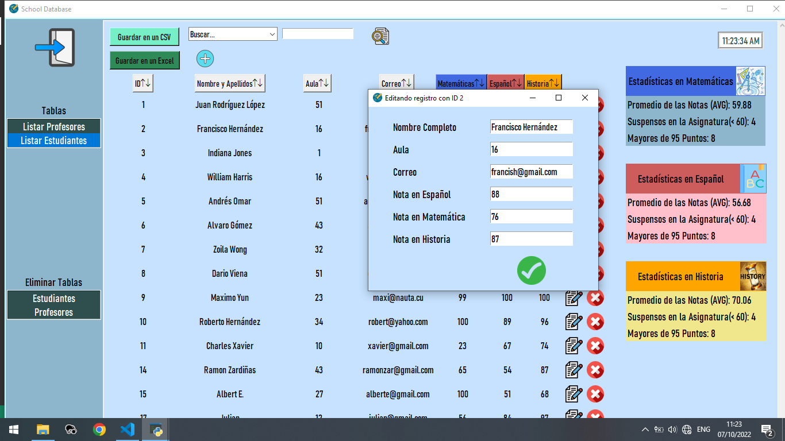

- Update students or teachers information
    * Processing of the actions (SQL sentences in Python code)

```python
       
def aplicar_cambios(estudiante_o_profesor,id_reference):
    con=sqlite3.connect('Escuela.db')    #Create a database or connect to one
    c= con.cursor()                     #Create cursor
    if estudiante_o_profesor==0:
        c.execute("""UPDATE Estudiantes SET
                'nombre_completo'=:nombre_completo,
                'aula'=:aula,
                'correo'=:correo,
                'math'= :math,
                'spanish'= :spanish,
                'history'= :history
                WHERE oid = :oid""",
                {
                'nombre_completo':f_nombre_completo_top.get(),
                'aula':f_aula_top.get(),
                'correo':f_correo_top.get(),
                'math':f_nota_math_top.get(),
                'spanish':f_nota_spanish_top.get(),
                'history':f_nota_history_top.get(),
                'oid':id_reference
                })                         #Insertar en tabla
        
        #Limpiar cuadros de texto
        f_nombre_completo_top.delete(0,END)
        f_aula_top.delete(0,END)
        f_correo_top.delete(0,END)
        f_nota_math_top.delete(0,END) 
        f_nota_spanish_top.delete(0,END)   
        f_nota_history_top.delete(0,END)
        con.commit()
        c.close() 
        listar(estudiante_o_profesor)
    else:
        c.execute("SELECT COUNT(aula) FROM Estudiantes WHERE aula = '{}' ".format(f_aula_top.get()))
        r=c.fetchall()
        
        if r[0][0]!=0:
            c.execute("""UPDATE Profesores SET
                    'nombre_completo'=:nombre_completo,
                    'aula'=:aula,
                    'correo'=:correo
                    WHERE oid = :oid""",
                    {
                    'nombre_completo':f_nombre_completo_top.get(),
                    'aula':f_aula_top.get(),
                    'correo':f_correo_top.get(),
                    'oid':id_reference
                    })                         #Insertar en tabla
            
            #Limpiar cuadros de texto
            f_nombre_completo_top.delete(0,END)
            f_aula_top.delete(0,END)
            f_correo_top.delete(0,END)
            con.commit()
            c.close() 
            listar(estudiante_o_profesor)
        else:
            aula_sin_estudiantes()

```


- Delete students or teachers of the table
    * Visual Interface
    * Processing of the actions (SQL sentences in Python code)

```python
def Eliminar_tabla(valor):
    target_table_options=mylistbox_admin3.get(ANCHOR)
    respuesta=messagebox.askyesno("Estás seguroooo!!??",f"Eliminarás todo de tu tabla {target_table_options}\nEstás seguro??!!")
    if respuesta==1:
        con=sqlite3.connect('Escuela.db')    #Create a database or connect to one
        c= con.cursor()                     #Create cursor
        c.execute(f"DROP TABLE {target_table_options}")
        con.commit()
        con.close()
        create_table()
    if target_table_options=="Estudiantes":
        listar(estudiante_o_profesor=0)
    else:
        listar(estudiante_o_profesor=1)

```

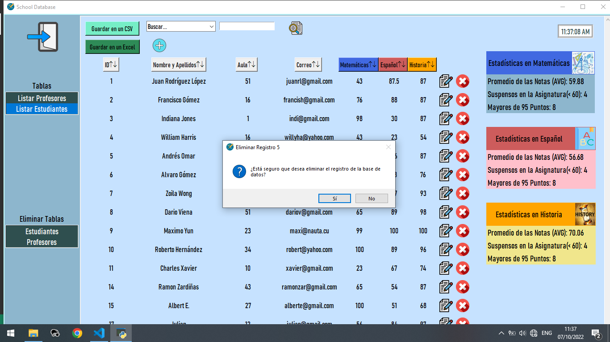

This way the student with ID=5 was deleted of the "Escuela" database.

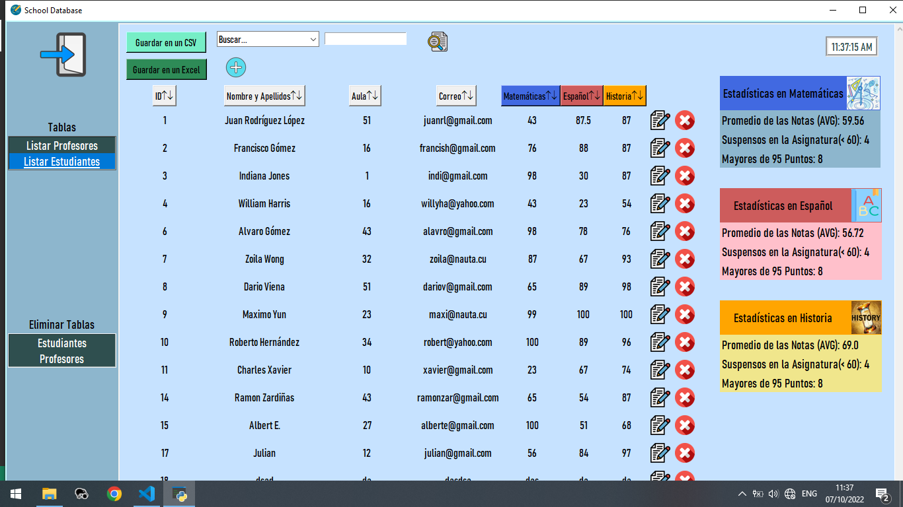

- Sort students or teachers information 
    * Processing of the actions (SQL sentences in Python code)

```python
def ordenar(estudiante_o_profesor,parametro):
    listar(estudiante_o_profesor)
    for widget in panel2_admin.winfo_children():
        if widget not in [f_busqueda,buscar_btn_combo,buscar_btn,agregar_estudiante_btn]:
            widget.destroy()      
    global state_order
    con=sqlite3.connect('Escuela.db')    #Create a database or connect to one
    c=con.cursor()                    #Create cursor
    if state_order==1:
        
        c.execute(f"SELECT * FROM {TABLE_NAME[estudiante_o_profesor]} ORDER BY {parametro} DESC")
        state_order=0
    else:
        c.execute(f"SELECT * FROM {TABLE_NAME[estudiante_o_profesor]} ORDER BY {parametro}")
        
        state_order=1
    result=c.fetchall()

    mostrar_en_pantalla(estudiante_o_profesor,result)
    clock_admin()
    con.commit()
    c.close()

```

Sorting data by "Matemáticas" score ascending order

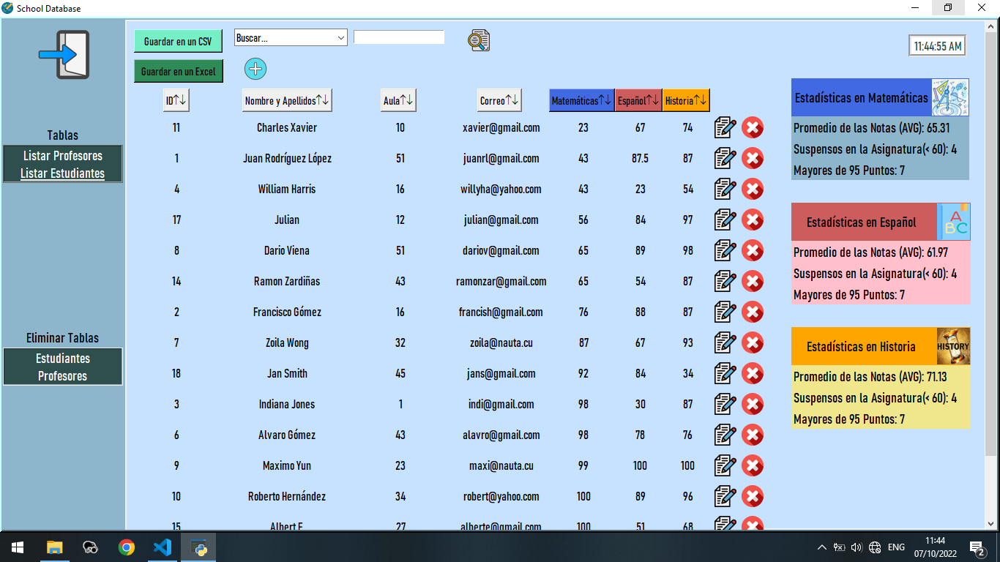

Sorting data by "Historia" score descending order

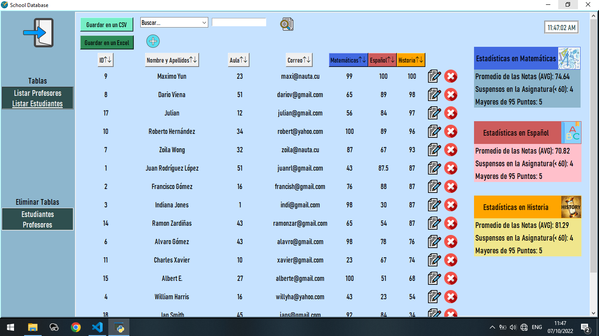

## Create an .exe aplication.

Our program it's ready. Let's make a .exe aplication using auto-py-to-exe.

Seting the following options for make an one file with ico and console hiden aplication:
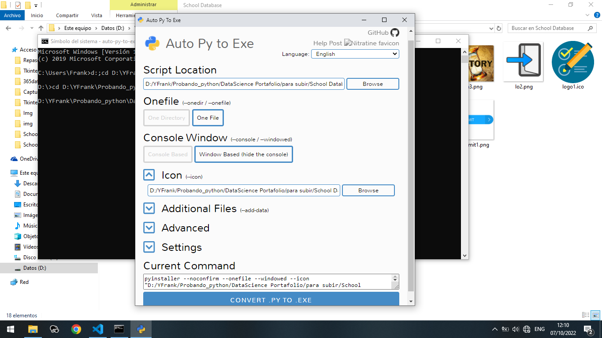

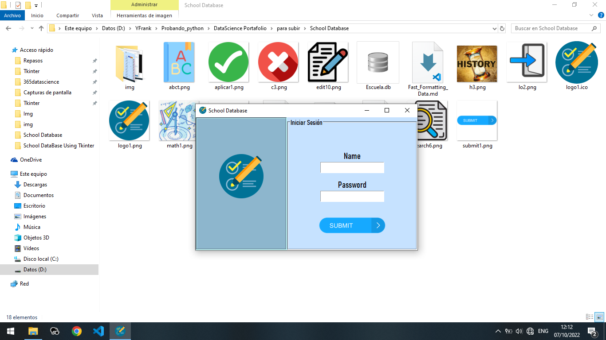
# Conclusion

The aplication allows a better manage of the data of students and teachers for a school. 

This project was a real challenge. The use of Tkinter for the visual interface and the integration with the database created in sqlite3 was an amazing experience for me as a developer.

I want to thanks all the people of Stack Overflow forums, and some many web sites such as w3schools, freecodecamp and specially to the codemy youtube channel dedicated to Tkinter for the wonderfull knowledge that it shares on the Internet.
